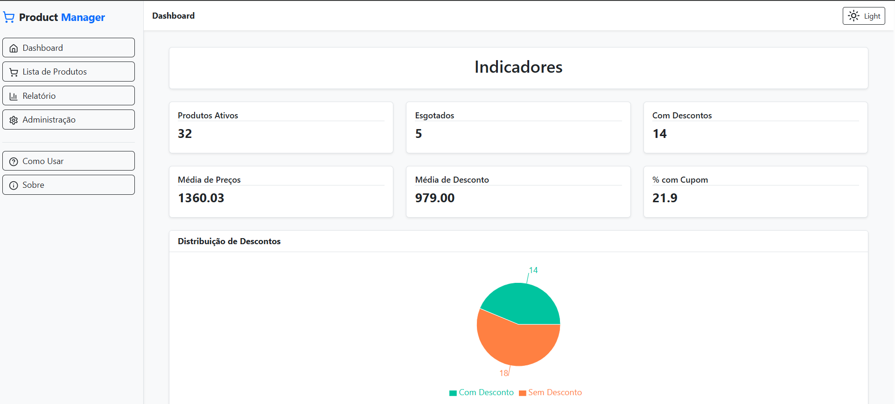
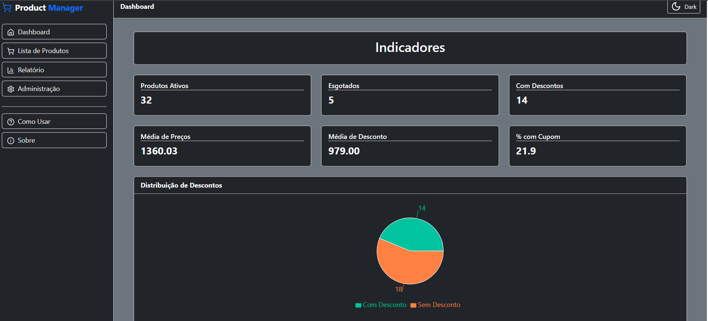
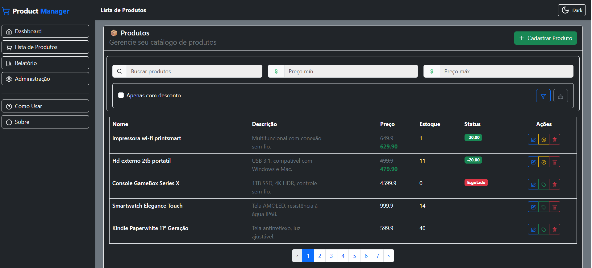
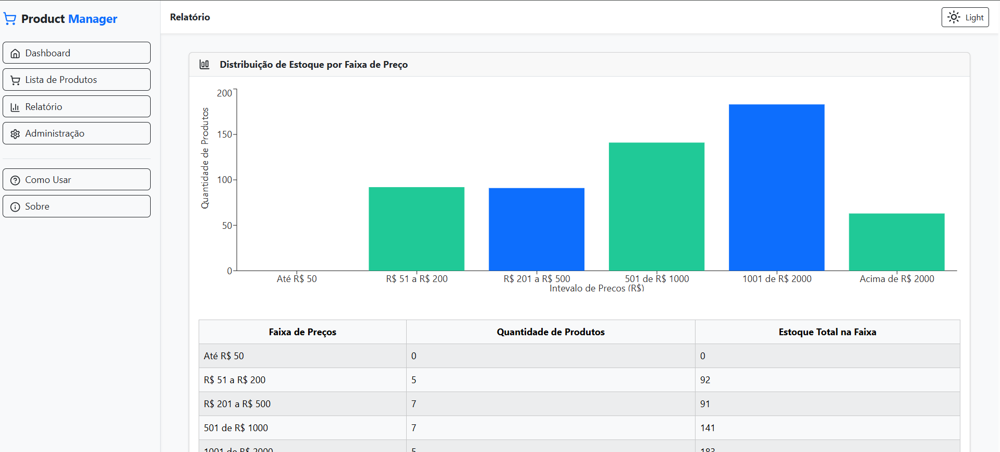
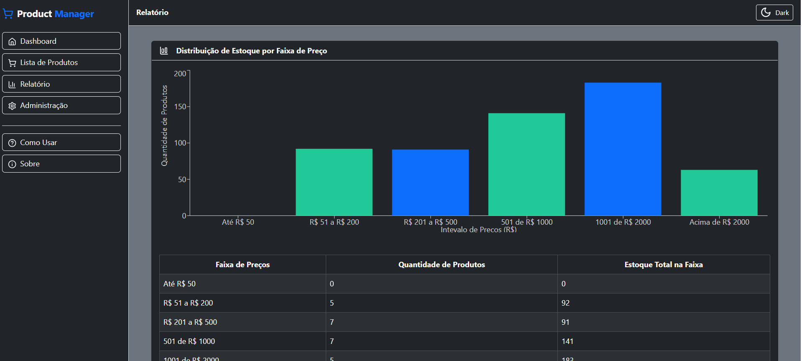
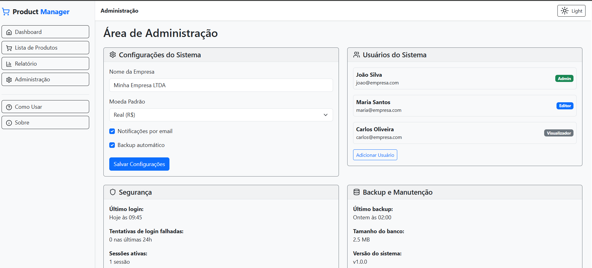
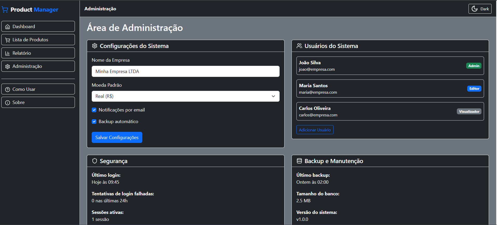
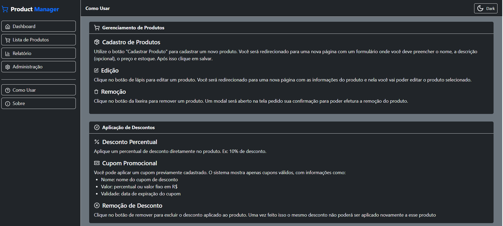
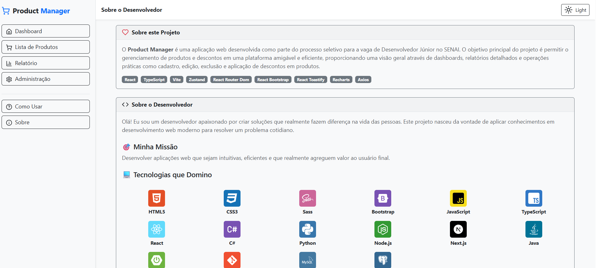
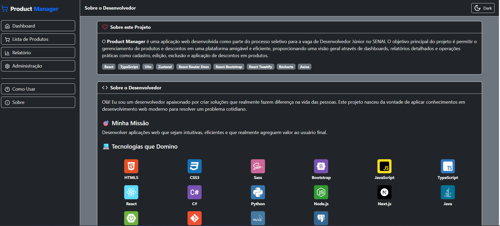

# 🛒 Product Manager

Sistema completo para **gestão de produtos** e **aplicação de descontos promocionais** por valor percentual ou cupons. O sistema também apresenta **dashboards analíticos** e **relatórios gerenciais**, permitindo uma visão clara e eficiente dos dados.

---

## 🚀 Funcionalidades

### 🧾 Catálogo de Produtos

- Cadastro, edição e exclusão de produtos
- Filtros por nome, faixa de preço e presença de desconto
- Paginação de resultados
- Aplicação de descontos:
  - ✅ Percentual
  - ✅ Cupons (válidos, com data e limite de uso)

### 💸 Descontos e Cupons

- Sistema robusto para cupons e descontos ativos
- Aplicação de cupons diretamente nos produtos
- Verificação de validade, limite de uso e valor de desconto

### 📊 Dashboard Executivo

Painel com KPIs de alto nível:

- Total de produtos ativos
- Produtos esgotados
- Produtos com descontos ativos
- Valor médio dos produtos e dos descontos
- Percentual de produtos com cupons
- Gráficos (linha e pizza)

### 📑 Relatórios Avançados

1. **Distribuição de Estoque por Faixa de Preço**
2. **Impacto Financeiro dos Descontos**
3. **Produtos com Maior Estoque e Desconto Ativo**
4. **Top Produtos com Maior Redução em Valor Absoluto**
5. **Efetividade dos Cupons (uso por código)**
6. **Comparativo: Preço Original vs Final**
7. **Produtos com Cupons Prestes a Expirar**

---

## 💻 Tecnologias Utilizadas

- **React** (com TypeScript)
- **Zustand** – Gerenciamento de estado global
- **React Router DOM** – Roteamento de páginas
- **React Bootstrap** – UI responsiva e acessível
- **React Toastify** – Feedback para ações do usuário
- **Recharts** – Gráficos interativos
- **Axios** – Comunicação com API
- **Theme Context** – Alternância entre tema claro e escuro

---

## 🎨 Design Responsivo

Interface adaptada para **dispositivos móveis**, **tablets** e **desktop**, com alternância de tema claro/escuro ajustável no menu.

---

## 📷 Capturas de Tela

<p align="center">
  
  
</p>

<p align="center">
  
  
</p>

<p align="center">
  
  
</p>

<p align="center">
  
  
</p>

<p align="center">
  
  
</p>

<p align="center">
  
  
</p>

---

## 📁 Organização do Projeto

```bash
src/
├── components/
│ ├── layouts/
│ ├── modals/
│ ├── products/
│ ├── reports/
│ ├── Logo.tsx
│ ├── ThemeToggle.tsx
├── pages/
│ ├── DashboardPage.tsx
│ ├── ProductCatalog.tsx
│ ├── ReportsPage.tsx
├── routes/
├── schemas/
├── services/
├── store/
├── theme/
├── utils/
├── App.tsx/
├── index.css/
├── index.tsx/
```

---

## ⚙️ Como Executar

1. Clone o repositório:

```bash
git clone git@github.com:Neto-Pereira25/product_manager.git

cd product_manager/frontend
```

2. Instale as dependências:

```bash
npm install
```

3. Inicie o projeto:

```bash
npm run dev
```

---

## 👨‍💻 Autor

Desenvolvido por José Pereira da Silva Neto

- 📧 devneto203@gmail.com
- 🔗 [LinkedIn](https://www.linkedin.com/in/jose-neto-programador/)
